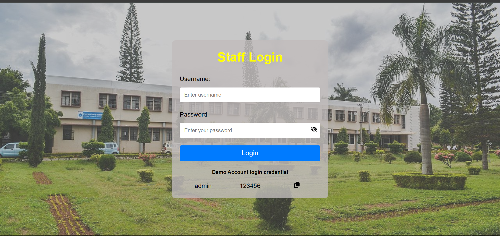
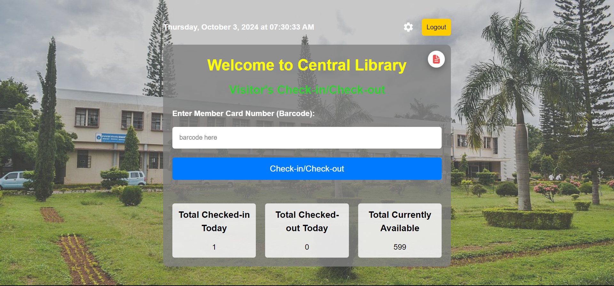
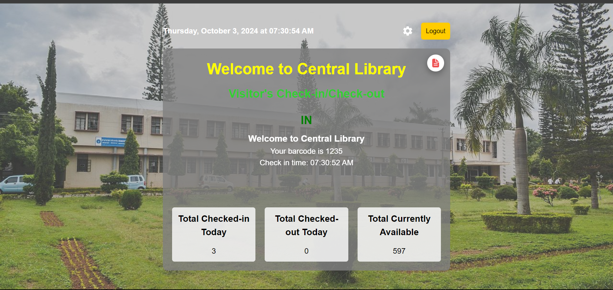
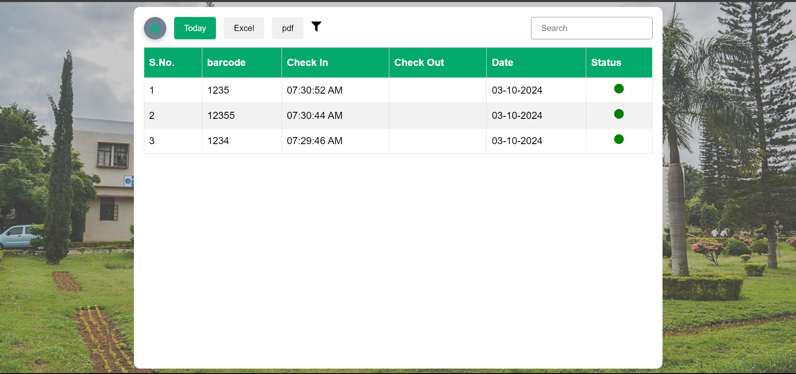
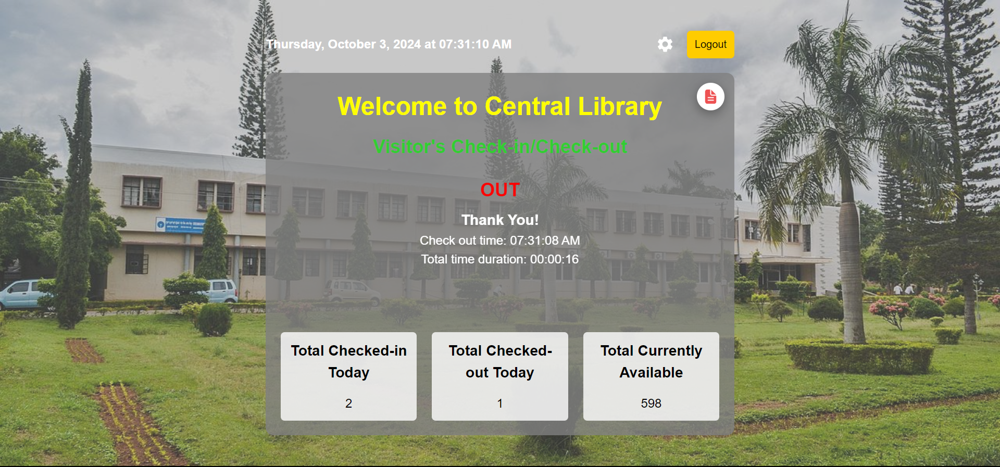

# Library User Tracker App
developed using React for frontend and expressjs and mongodb for backend

<a href="https://keen-lokum-279032.netlify.app/" target="_blank">Visit LibraryUserTracker</a>








## Tech Stack
- React
- CSS
- MySQL
- Nodejs

## Features

- Authentication
- library user trackring

## How to use

1. Clone the repo

```bash
git clone https://github.com/ashuhitman/quizkosh
```

2. Install dependencies

```bash
npm install
```

3. Start the dev server

```bash
npm run dev
```

## Contributing

Pull requests are welcome. For major changes, please open an issue first to discuss what you would like to change.

## License

This project is open source and available under the [MIT License](LICENSE).
